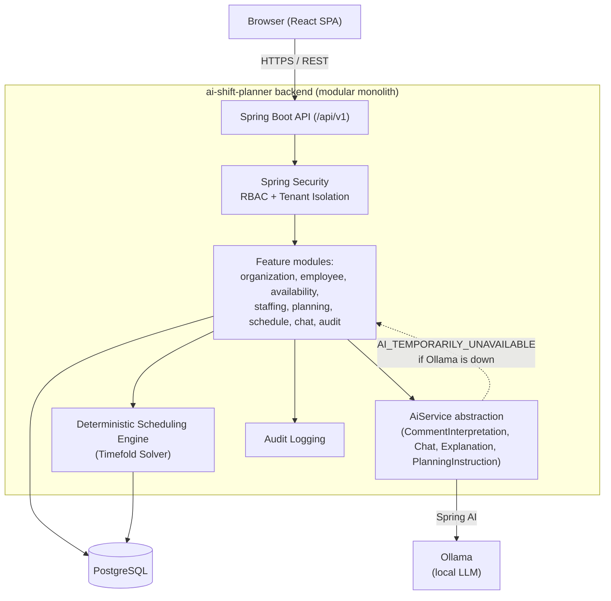
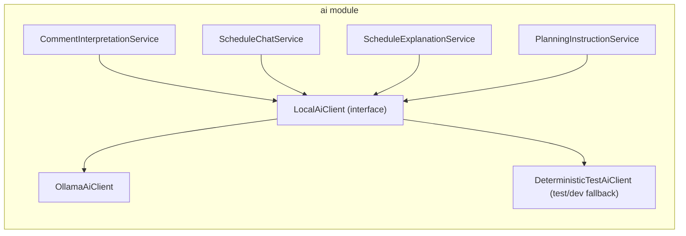
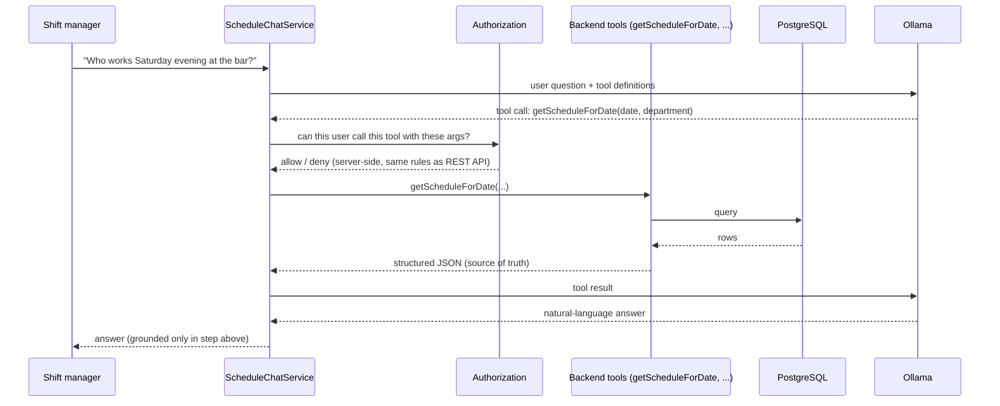
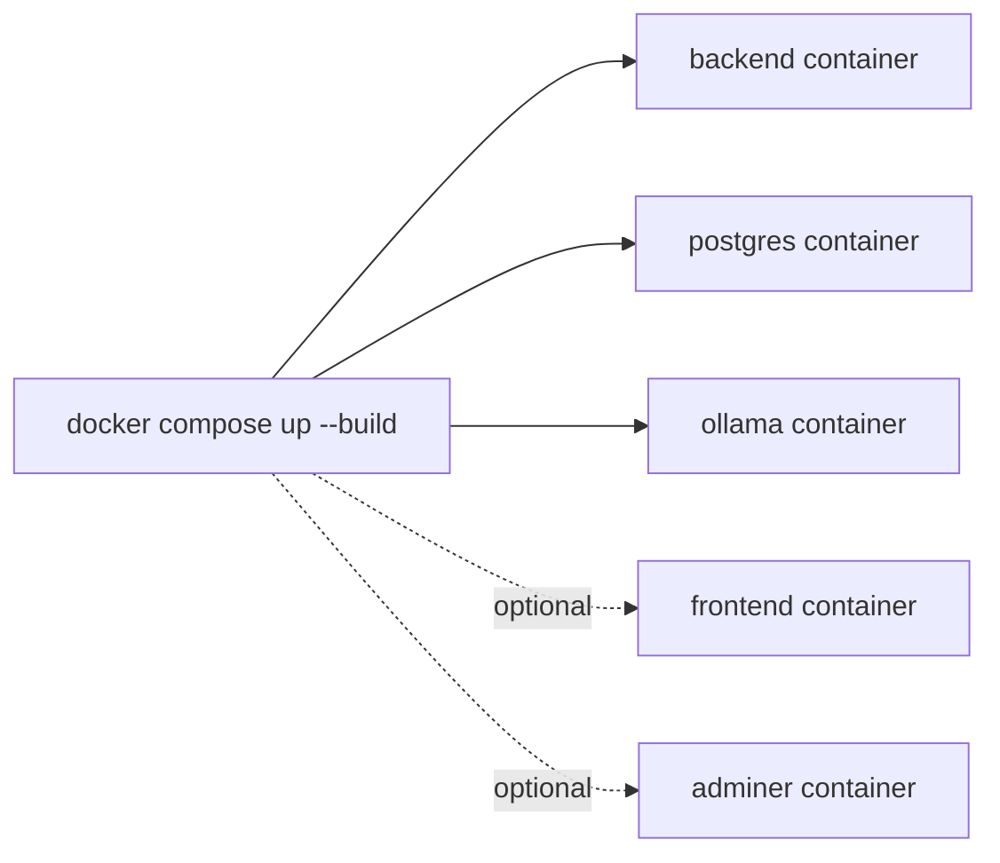
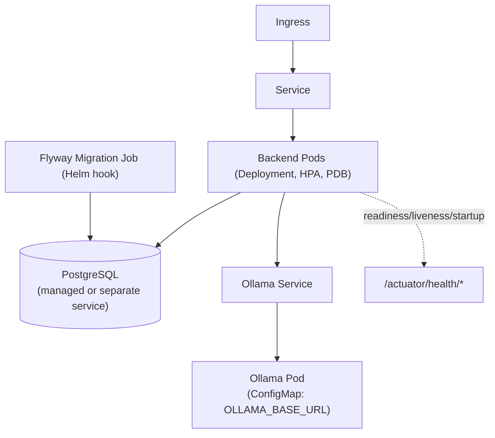

# Architecture — AI Shift Planner

## 1. Product summary

AI Shift Planner is a multi-tenant SaaS platform that generates gastronomy shift schedules
in minutes instead of hours, while respecting availability, preferences, skills, contract
hours, minimum staffing, cost, fairness, overtime, rest time, departments and locations.

The system is a **modular monolith** (see ADR-009) split into two clearly separated layers:

- a **deterministic scheduling engine** (Java + Timefold Solver) that owns every actual
  shift assignment, cost calculation and constraint decision, and
- a **local-AI layer** (Spring AI + Ollama) that only interprets language, explains
  decisions made by the solver, and answers chat questions using tool-called facts from
  the database.

The LLM never assigns a shift. The solver never depends on the LLM being available.

## 2. High-level component view



Key property: every arrow from `Modules`/`Solver` into `DB` continues to work even if the
`Ollama` box is completely gone. Only the `AiFacade` arrow is allowed to fail, and it fails
soft (a typed status), never by throwing the request away.

## 3. AI abstraction



`LocalAiClient` is the single seam between business code and any model provider. Swapping
Ollama for OpenAI, Azure OpenAI, Anthropic or Mistral later means adding one new
implementation class and a Spring profile — no changes to callers.

## 4. Chat / tool-calling flow



The LLM never receives a full database dump and never receives data the caller is not
authorized to see — authorization is checked **before** a tool executes, not by trusting
the prompt.

## 5. Deployment views

### 5.1 Local development



### 5.2 Kubernetes



Flyway migrations run in a dedicated Kubernetes Job (a Helm pre-upgrade hook), not inside
every application pod's startup path, to avoid multiple pods racing to migrate the schema
concurrently during a rolling deployment.

## 6. Domain hierarchy

```
Organization
  └── Location (own IANA timezone, e.g. Europe/Berlin)
        └── Department (data-driven, not hardcoded: Küche, Theke, Bar, ...)
              └── Employee (skills, contract hours, employment type)
```

Every tenant-scoped entity carries `organizationId`; tenant isolation is enforced in the
backend (repository/service layer), never only via the frontend.

## 7. Package structure (package-by-feature)

```
com.aishiftplanner.scheduler
├── auth/
├── organization/
├── employee/
├── availability/
├── staffing/
├── planning/
├── schedule/
├── ai/
├── chat/
├── audit/
└── shared/
```

Within larger modules, code is further split into `api` (controllers/DTOs), `application`
(use cases/services), `domain` (entities/domain logic) and `infrastructure` (repositories,
external clients) — only where that separation earns its keep. No interfaces are created
purely out of habit.

## 8. Non-goals for the MVP

Payroll, time tracking, POS integration, native mobile apps, enterprise SSO, demand
forecasting and event streaming are explicitly out of scope; the domain model and module
boundaries leave room for them (see `docs/adr` and section 92 of the product brief) without
requiring a rewrite.
